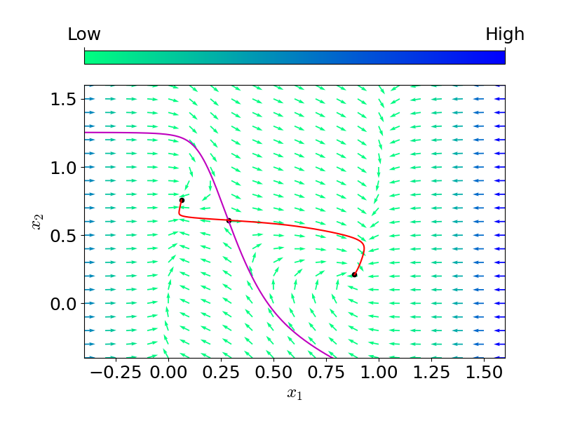

# Nonlinear_program
非線形システムの位相図の描画を行う．

ただし，以下の tunnel-diode circuit model を例にする．
$$
\dot{x}_1 = 0.5 (-h(x_1) + x_2), \\
\dot{x}_2 = 0.2(-x_1 - 1.5 x_2 + 1.2),
$$
ただし，
$$
h(x_1) = 17.76 x_1 - 103.79 x_1^2 + 229.62 x_1^3 - 226.31 x_1^4 + 83.72 x_1^5
$$
とする．

以下のような位相図を描画するためのプログラムを作成した．



サドルの平衡点において，

- 黒点: 平衡点
- 紫線: 安定多様体
- 赤線: 不安定多様体

とした．

## 使用言語
- Python (3系)
    - Python 3.8 (pip3) での動作確認済 (Docker Container として環境構築)．
    - Google Colab での動作確認済 (iPython Notebook)．

## 各クラス，関数について
ここでは，`./phase_portrait.py` 内のクラスや関数について簡単に解説する．

### `System` クラス
このクラスは，システムの定義と数値積分の実装をしている．

#### `dynamics` メソッド
ダイナミクスの定義．

##### 注意点
- `scipy.integrate` の [`solve_ivp`](https://docs.scipy.org/doc/scipy/reference/generated/scipy.integrate.solve_ivp.html) を用いて数値積分を行うために，引数に時刻 `t` を含めている．
- 状態ベクトル `z` は1次元であっても `numpy.ndarray` 形式で定義する必要がある．

#### `equilibrium_point` メソッド
ダイナミクスの平衡点を求める．

##### 注意点
- `scipy.optimize` の [`fsolve`](https://docs.scipy.org/doc/scipy/reference/generated/scipy.optimize.fsolve.html#scipy.optimize.fsolve) を用いて平衡点を数値的に求める．
    - `fsolve` を用いて解を求めるために時刻 `t` を含めないメソッド (`dynamics_without_t`) も用意した．

#### `solve_dynamics` メソッド
`scipy.integrate.solve_ivp` を用いてダイナミクスの解軌道を数値的に求める．

##### 注意点
- 今回の返り値の `z` のサイズは `(2, N)` である．
    - `z[i] (i = 0, 1)` は，各時点 `n = 0, 1, ..., N - 1` における状態 $x_i \ (i = 1,2)$ の値を要素に持つサイズ `N` の `numpy.ndarray` 形式の `array`． 
- 逆時間の解軌道を求める際は，逆時間のダイナミクスを定義する．

### `Phase_portrait` クラス
#### `phase_portrait` メソッド
位相図を描画する．ベクトル場の描画には，`matplotlib.pyplot` の [`quiver`](https://matplotlib.org/stable/api/_as_gen/matplotlib.pyplot.quiver.html) を用いている．

2次元システムの位相図の描画に限定して説明する． `matplotlib.pyplot.quiver` は以下のように呼び出す．

```python
quiver([X, Y], U, V, [C], **kw)
```
ただし，
- `X, Y` (`numpy.ndarray`): 座標
    - 各 `x, y` を1次元の `numpy.ndarray` で定義し，`numpy.meshgrid` で2次元に拡張する．
- `U, V` (`numpy.ndarray`): ベクトルの第1成分および第2成分
    - `X, Y` と同じサイズである必要がある．
    - `U, V` の各要素は，各座標におけるベクトルの第1成分および第2成分．
- `C` (`numpy.ndarray`): ノルム
    - `X, Y` と同じサイズである必要がある．

以降，コードを用いて説明する．

```python
##### vector field #####
x_range = np.linspace(-0.4, 1.6, 21)
y_range = np.linspace(-0.4, 1.6, 21)
X, Y = np.meshgrid(x_range, y_range)    # 格子点を作る, size: (21, 21)
dX = np.empty_like(X); dY = np.empty_like(Y)
for i in range(len(X)):
    for j in range(len(X[i])):
        vecx = np.array([X[i][j], Y[i][j]]) # (i, j)におけるベクトルx
        dX[i][j] = self.dynamics(0, vecx)[0]    # ダイナミクスのx成分
        dY[i][j] = self.dynamics(0, vecx)[1]    # ダイナミクスのy成分
########################
```

このコードブロックでは，`x` 成分と `y` 成分の点集合 (`x_range, y_range`) から2次元格子を生成し (`X, Y`)，各格子点における微小変化量を `dX, dY` に代入している．

```python
### difine figure ###
fig = plt.figure(figsize=(8,6))
fig.subplots_adjust(bottom=0.15, left=0.15)
ax = fig.add_subplot(1,1,1)
ax.set_xlabel(r'$x_1$'); ax.set_ylabel(r'$x_2$')
ax.set_xlim([-0.4, 1.6]); ax.set_ylim([-0.4, 1.6])
#####################
```

このコードブロックでは，図の定義を行っている．描画領域，`x, y` のラベルを定めている．

```python
### calculate the norm of vector ###
nrm = np.sqrt(pow(dX, 2) + pow(dY, 2))
maxnrm = []; minnrm = []
for i in range(len(nrm)):
    # 各 i に対して nrm[i] の size は 21
    maxnrm.append(max(nrm[i]))  # nrm[i] の最大値
    minnrm.append(min(nrm[i]))  # nrm[i] の最小値
####################################
```

このコードブロックでは，各格子点における微小変化量のノルム，およびその最大値および最小値を求めている．

```python
### plot vector and add colorbar ###
divider = make_axes_locatable(ax)
cax = divider.append_axes("top", size="5%", pad=0.3)
# ベクトルの正規化．ノルムが0のところは0にする．
dX_nrm = np.divide(dX, nrm, out=np.zeros_like(dX), where=nrm!=0)
dY_nrm = np.divide(dY, nrm, out=np.zeros_like(dY), where=nrm!=0)
# ベクトル場の描画
im = ax.quiver(X, Y, dX_nrm, dY_nrm, nrm, cmap='winter_r')
# colorbar の描画
cbar = fig.colorbar(im, cax=cax, ticks=[min(minnrm), max(maxnrm)], orientation='horizontal')
cax.xaxis.set_ticks_position('top')
cbar.ax.set_xlim(min(minnrm),max(maxnrm))
cbar.ax.set_xticklabels(['Low', 'High'])  # horizontal colorbar
####################################
```

このコードブロックでは，ベクトル場およびカラーバーの描画を行っている．

`dX_nrm, dY_nrm` は求めたノルムを用いてベクトルの正規化を行ったものである．

`matplotlib` では，colormap を指定することができる．指定することのできる colormap の一覧は，[Choosing Colormaps in Matplotlib](https://matplotlib.org/stable/tutorials/colors/colormaps.html) を参照．ただし，`*_r` はデフォルトで定義されているカラーマップを逆にする操作である．

`dX_nrm, dY_nrm, ax.quiver` 以外は，カラーバーの描画のための操作である．
(参考: [[matplotlib] 55. Colorbarの目盛りとそのラベルの設定](https://sabopy.com/py/matplotlib-55/))
具体的な値よりも値の大小がどうかを見たかったので，ラベルを `Low` および `High` とした．

```python
### plot stable manifold ###
if stable_list != []:
    for sol in stable_list:
        ax.plot(sol[0], sol[1], c='m')
############################

### plot unstable manifold ###
if unstable_list != []:
    for sol in unstable_list:
        ax.plot(sol[0], sol[1], c='r')
##############################

### plot equilibrium points ###
if equiv_list != []:
    for equiv in equiv_list:
        ax.scatter(equiv[0], equiv[1], c='k', marker='o', s=20)
###############################
```

このコードブロックでは，平衡点，サドルの平衡点の安定多様体，不安定多様体をプロットしている．